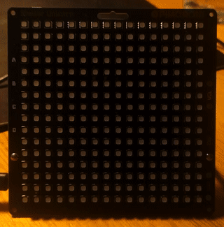
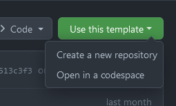
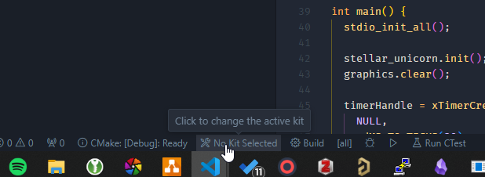
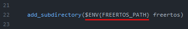
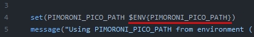

# Boilerplate: Pico Pimoroni & FreeRTOS



A boilerplate for a RP2040 pico project using Pimoroni hardware and FreeRTOS. This boilerplate is based on the project [pico-boilerplate](https://github.com/pimoroni/pico-boilerplate) done by Pimoroni with a couple of adjustments.

The guide is split up in **seven** steps:

1. Install WSL
2. Install Visual Studio Code
3. Installation of the toolchain
4. Cloning the required repositories
5. Configuring FreeRTOS CMake
6. `Optional` Cloning & building examples
7.  Configuring the PATH
8.  Creating a project using this template

## Install WSL

To compile our projects, we are going to use WSL. It's mainly that the guide for the pico SDK installation uses Linux.

Open up **Powershell** as an administrator (or similar) and execute...

```bash
wsl --install
```

...which sets up the WSL environment. It may take a while until it's finished.

> ### ⚠ WSL1 & WSL2 ⚠
>
> Depending on the performance, the WSL version might need to be changed
> 
> ```bash
> wsl --set-version <dist> 1 # for WSL 1 or... 
> wsl --set-version <dist> 2 # ...for WSL 2
> ``` 

## Install Visual Studio Code

After installing WSL, let's install Visual Studio Code and its extensions. Of course, only do that, if you want to use VSCode.

1. Install Visual Studio Code &rarr; [Link](https://code.visualstudio.com/)
2. After that's done, install following extensions:
   - [C/C++](https://marketplace.visualstudio.com/items?itemName=ms-vscode.cpptools)
   - [CMake Tools](https://marketplace.visualstudio.com/items?itemName=ms-vscode.cmake-tools)
   - [WSL](https://marketplace.visualstudio.com/items?itemName=ms-vscode-remote.remote-wsl)
   - [Serial Monitor](https://marketplace.visualstudio.com/items?itemName=ms-vscode.vscode-serial-monitor) – Optional & only **Local** (not WSL)

That should be it for the IDE enviornment.

## Installation of the toolchain

Open up a command line (`cmd.exe` or VSCodes integrated terminal) and type in following commands

```bash
sudo apt update
sudo apt install git cmake gcc-arm-none-eabi libnewlib-arm-none-eabi build-essential libstdc++-arm-none-eabi-newlib
```

This installs all the tools, such as `git` for projects handling, `cmake` for configuring projects & build environment and `gcc-arm-none-eabi` for the compile & build tools.

## Cloning the required repositories

Now with the toolchain setup, Pico-SDK, FreeRTOS and Pimoroni-Library need to be installed. For that, a clean folder structure needs to be setup, before cloning everything.

Following folder structure will be setup:

```
~/📁 pico
   /📁 freertos
     /📁 FreeRTOS-Kernel
   /📁 projects
     /📙 *this boilerplate project*
   /📁 pico-examples
   /📁 pico-sdk
   /📁 pimoroni-pico
```

1. First we install the pico-SDK, by creating a pico folder and cloning the repository into said folder.

```bash
# jump to home folder...
cd "~/"

# ...create pico folder...
mkdir pico
cd pico
# ...and clone pico-SDK
git clone -b master https://github.com/raspberrypi/pico-sdk.git --recursive
```

3. Then the pimonori library (which has examples directly included in the library)

```bash
git clone -b main https://github.com/pimoroni/pimoroni-pico.git --recursive
```

4. And lastly the FreeRTOS-library

```bash
mkdir freertos
cd freertos
git clone https://github.com/FreeRTOS/FreeRTOS-Kernel
```

## Configuring FreeRTOS CMake

Before FreeRTOS can actually be used, a `CMakeLists.txt` file needs to be created inside the `freertos` folder. This way we prepare the library for inclusion in the project.

```bash
cd ~/pico/freertos
touch "CMakeLists.txt"
nano "CMakeLists.txt" # open file and edit -> VSCode can also be used as an editor.
```

Following content needs to be inserted in that file.

```cmake
set(PICO_SDK_FREERTOS_SOURCE FreeRTOS-Kernel)

add_library(freertos
    ${PICO_SDK_FREERTOS_SOURCE}/event_groups.c
    ${PICO_SDK_FREERTOS_SOURCE}/list.c
    ${PICO_SDK_FREERTOS_SOURCE}/queue.c
    ${PICO_SDK_FREERTOS_SOURCE}/stream_buffer.c
    ${PICO_SDK_FREERTOS_SOURCE}/tasks.c
    ${PICO_SDK_FREERTOS_SOURCE}/timers.c
    ${PICO_SDK_FREERTOS_SOURCE}/portable/MemMang/heap_3.c
    ${PICO_SDK_FREERTOS_SOURCE}/portable/GCC/ARM_CM0/port.c
)

target_include_directories(freertos PUBLIC
    .
    ${PICO_SDK_FREERTOS_SOURCE}/include
    ${PICO_SDK_FREERTOS_SOURCE}/portable/GCC/ARM_CM0
)
```

## `Optional` Cloning & building Pico & Pimoroni examples

If you want to have examples to test out the board and display, we additionally need to clone the Pico Examples repository and build both projects. **Note: this takes a while!**

```bash
git clone -b master https://github.com/raspberrypi/pico-examples.git
```

After having cloned the examples, we start building the examples.

```bash
cd ~/pico/pico-examples
mkdir build
cd build
cmake ..
make -j3 # use 3 processes (so far best trade off for my old pc)
```

And the same with the pimoroni examples - **This one takes a lot longer!**

```bash
cd ~/pico/pimoroni-pico
mkdir build
cd build
cmake ..
make -j3 # use 3 processes (so far best trade off for my old pc)
```

## Configuring the PATH

By default, the libraries can't be used on their own, due to some PATH-variables missing.

```bash
sudo nano ~/.bashrc
```

At the end of the `.bashrc`-file add following block, with `<USERNAME>` replaced with your Linux username.

```bash
# [Pico SDK, Libraries Paths]
export PICO_SDK_PATH="/home/<USERNAME>/pico/pico-sdk/"
export PIMORONI_PICO_PATH="/home/<USERNAME>/pico/pimoroni-pico/"
export FREERTOS_PATH="/home/<USERNAME>/pico/freertos/"
```

Then `source` the `.bashrc`-file, so changes are actually applied.

```bash
source ~/.bashrc
```

## Creating a project using this template

Open up the template-repository (if you read this, you should already be on it or else here: [Link](https://github.com/joelvonrotz/pico_freertos_pimoroni_boilerplate)) in Github and click `Use this template`.



Once you've created a repository with it, clone it using VSCode's repository cloning option and open it up.

When opening up the project, CMake should automatically ask for a *Kit*, which is just the toolchain. Select the one that is in the `/etc/bin/...`-folder, **NOT** the `/mnt/c/...`-folder!



## Notes

One of these adjustments is the usage of environment variables. This completely breaks the usage of local options, but I don't mind.

To use local versions, the `.cmake`-files need to be adjusted to use a variable instead of a enviornment variable (if you know CMake, it should be easy). -> specifically `pimoroni_pico_import.cmake` & line 22 in the project `CMakeLists.txt` needs to be updated.



